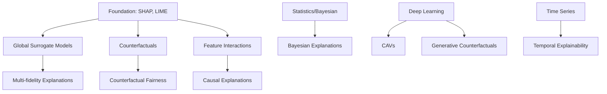

# Advanced Explainability Techniques - Comprehensive Upskilling Matrix

## 📋 Complete Advanced Learning Matrix

| **Topic Name** | **Explainability Contribution/How It Helps** | **Learning Focus** | **Time Investment** | **Difficulty** | **Priority** | **Prerequisites** |
|----------------|-----------------------------------------------|-------------------|-------------------|----------------|-------------|------------------|
| **Global Surrogate Models (GAMS, EBMs)** | Approximate complex models globally with interpretable models, enabling understanding of overall model behavior beyond simple trees | GAM structures, spline functions, EBM training, interpretable approximations | 1-2 weeks | Advanced | High | SHAP, Statistical modeling |
| **Anchors (High-Precision Local Rules)** | Provide clear, high-confidence if-then rules explaining individual predictions, enhancing actionable local interpretability | Rule generation algorithms, precision-coverage trade-offs, confidence intervals | 4-5 days | Intermediate | Medium | LIME, Rule-based learners |
| **Counterfactual and Contrastive Explanations** | Identify minimal input changes that alter predictions, offering insight into decision boundaries and actionable model understanding | Optimization algorithms, constraint satisfaction, feasibility checking | 1 week | Advanced | High | LIME, Optimization basics |
| **Prototype and Criticism-based Explanations** | Summarize model behavior using representative and exceptional examples, helping grasp typical and edge-case model decisions | Clustering algorithms, MMD-critic, prototype selection, outlier detection | 5-6 days | Intermediate | Medium | Basic ML, Clustering |
| **Feature Interaction Detection** | Reveal and quantify how features interact in influencing predictions, uncovering complex dependencies beyond single features | H-statistic, SHAP interactions, functional ANOVA, interaction strength metrics | 1 week | Advanced | High | SHAP, Statistical analysis |
| **Accumulated Local Effects (ALE) Plots** | Provide unbiased feature effect visualizations accounting for feature correlations, improving reliability over traditional PDPs | ALE computation, correlation handling, unbiased estimation, comparative analysis with PDPs | 3-4 days | Intermediate | High | Partial dependence plots |
| **Counterfactual Generative Models** | Generate realistic counterfactual examples constrained by data distribution, improving trustworthiness of what-if analyses | VAEs, GANs for counterfactuals, distribution constraints, realism metrics | 2 weeks | Expert | Medium | Deep learning, VAE/GAN basics |
| **Concept Activation Vectors (CAVs)** | Link model decisions to human-understandable concepts, bridging gap between raw features and semantic explanations | TCAV methodology, concept learning, linear probing, semantic interpretability | 1-2 weeks | Advanced | Medium | Deep learning, Linear algebra |
| **Integrated Gradients and Gradient-based Attribution** | Attribute predictions to input features via gradients, useful for differentiable models and deeper insight into feature influence | Gradient computation, path integration, baseline selection, attribution axioms | 1 week | Advanced | Medium | Calculus, Gradient computation |
| **Explanation by Example (Nearest Neighbors/Influence Functions)** | Explain predictions by referencing similar training data or influential points, increasing transparency through concrete examples | KNN algorithms, influence function computation, similarity metrics, case-based reasoning | 4-5 days | Intermediate | High | Distance metrics, KNN |
| **Rule Extraction via Model Distillation** | Derive compact, interpretable rule sets approximating complex models, aiding global understanding with human-readable logic | Knowledge distillation, decision tree induction, rule optimization, fidelity-interpretability trade-offs | 1 week | Advanced | Medium | Decision trees, Model distillation |
| **Surrogate Local Linear Models with Regularization** | Enhance local surrogate explanations by enforcing sparsity and stability, producing simpler and more consistent local interpretations | Regularization techniques (L1/L2), LASSO, Ridge, elastic net, local model fitting | 5-6 days | Intermediate | Medium | LIME, Regularization |
| **Multi-fidelity Explanations** | Combine explanations at multiple levels (feature, rule, example) to provide layered, comprehensive interpretability | Hierarchical explanations, multi-level aggregation, explanation fusion, consistency checking | 1 week | Advanced | Medium | Multiple explanation methods |
| **Counterfactual Fairness Explanations** | Explain model decisions under fairness constraints, ensuring transparency in sensitive or regulated contexts | Fairness metrics, bias detection, counterfactual fairness, algorithmic auditing | 1-2 weeks | Advanced | High | Fairness in ML, Ethics |
| **Causal Explanation Techniques** | Use causal inference to distinguish cause-effect relationships in feature impacts, improving trustworthiness of explanations | Causal graphs, do-calculus, Pearl's causal hierarchy, instrumental variables | 2-3 weeks | Expert | Medium | Causal inference, Statistics |
| **Bayesian Model Explanation** | Quantify uncertainty in explanations, providing probabilistic confidence and robustness in feature attributions | Bayesian inference, uncertainty quantification, credible intervals, posterior distributions | 1-2 weeks | Advanced | Medium | Bayesian statistics |
| **Visualization Techniques for High-Dimensional Data** | Use dimensionality reduction and visual overlays to interpret complex feature spaces and model clusters effectively | t-SNE, UMAP, PCA, interactive visualizations, embedding interpretation | 1 week | Intermediate | Medium | Dimensionality reduction |
| **Temporal and Sequential Explainability** | Explain predictions evolving over time or sequence, critical for time-dependent models in finance or risk analysis | Time series analysis, attention mechanisms, temporal attributions, sequence models | 1-2 weeks | Advanced | Medium | Time series, Sequential models |

## 🛤️ Advanced Learning Phases (Post-Foundation)

| **Phase** | **Duration** | **Topics** | **Learning Outcomes** | **Target Audience** |
|-----------|-------------|------------|----------------------|-------------------|
| **Phase 6: Global Interpretability** | Week 13-15 | Global Surrogate Models → ALE Plots → Feature Interaction Detection | Master global model understanding beyond simple importance | ML Engineers, Data Scientists |
| **Phase 7: Local Advanced Methods** | Week 16-18 | Anchors → Counterfactual Explanations → Explanation by Example | Advanced individual prediction analysis | Model Validators, Auditors |
| **Phase 8: Concept & Semantic Understanding** | Week 19-21 | Concept Activation Vectors → Prototype-Criticism → Multi-fidelity Explanations | Bridge technical and domain understanding | Domain Experts, Product Managers |
| **Phase 9: Fairness & Causality** | Week 22-25 | Counterfactual Fairness → Causal Explanations → Bayesian Explanations | Ethical AI and robust explanations | Compliance Officers, Researchers |
| **Phase 10: Specialized Applications** | Week 26-28 | Temporal Explainability → High-Dimensional Visualization → Generative Counterfactuals | Handle complex, domain-specific scenarios | Specialists, Advanced Practitioners |

## 🎯 Skills Progression for Advanced Techniques

| **Skill Level** | **Recommended Advanced Path** | **Core Competencies** | **Business Impact** |
|-----------------|------------------------------|---------------------|-------------------|
| **Expert Beginner** | Global Surrogates → ALE → Feature Interactions | Global model understanding, unbiased analysis | Strategic model insights, feature engineering guidance |
| **Advanced Practitioner** | Anchors → Counterfactuals → Explanation by Example | Actionable local insights, decision boundary understanding | Operational recommendations, model debugging |
| **Domain Specialist** | CAVs → Prototype-Criticism → Multi-fidelity | Semantic understanding, layered explanations | Domain-expert communication, business rule generation |
| **Research/Ethics Focus** | Causal Explanations → Fairness → Bayesian Uncertainty | Robust, fair, causally-grounded explanations | Regulatory compliance, ethical AI deployment |
| **Technical Specialist** | Gradient Attribution → Generative Counterfactuals → Temporal | Cutting-edge technical methods | Advanced R&D, novel application development |

## 🔧 Advanced Tool Selection by Business Need

| **Business Need** | **Primary Technique** | **Supporting Methods** | **Learning Priority** | **Implementation Complexity** |
|-------------------|----------------------|----------------------|---------------------|----------------------------|
| **Regulatory Compliance** | Counterfactual Fairness | Causal Explanations, Bayesian Uncertainty | Critical | High |
| **Strategic Decision Making** | Global Surrogate Models | Feature Interactions, Multi-fidelity | High | Medium |
| **Operational Recommendations** | Anchors, Counterfactuals | Explanation by Example | High | Medium |
| **Domain Expert Communication** | Concept Activation Vectors | Prototype-Criticism, Semantic Explanations | Medium | High |
| **Model Validation & Auditing** | ALE Plots, Feature Interactions | Surrogate Models, Bayesian Uncertainty | High | Medium |
| **Real-time Decision Support** | Anchors, Local Linear Surrogates | Fast counterfactuals | Medium | Low |
| **Research & Development** | Causal Explanations, Generative Methods | Gradient Attribution, Advanced Visualization | Low | Very High |
| **Time-sensitive Applications** | Temporal Explainability | Sequential Analysis | Medium | High |

## 📊 Implementation Readiness Matrix

| **Technique** | **Industry Adoption** | **Tool Availability** | **Research Maturity** | **Production Readiness** | **ROI Timeline** |
|---------------|----------------------|----------------------|---------------------|------------------------|------------------|
| **Global Surrogate Models** | Medium | Good (InterpretML, GAM) | High | Medium | 3-6 months |
| **Anchors** | Low | Limited (Alibi) | High | Low | 6-12 months |
| **Counterfactual Explanations** | Medium | Good (DiCE, Alibi) | High | Medium | 6-9 months |
| **ALE Plots** | Medium | Good (ALEPython, R packages) | High | High | 1-3 months |
| **Feature Interactions** | High | Good (SHAP, H-stat) | High | High | 1-2 months |
| **Prototype-Criticism** | Low | Limited (Research code) | Medium | Low | 12+ months |
| **CAVs** | Low | Limited (Research implementations) | Medium | Low | 12+ months |
| **Causal Explanations** | Low | Limited (DoWhy, CausalML) | Medium | Low | 12+ months |
| **Temporal Explainability** | Low | Limited | Low | Low | 12+ months |

## ⭐ Strategic Learning Recommendations

### **For Immediate Business Impact (Next 3 months)**
1. **ALE Plots** - Better than PDPs, immediate upgrade
2. **Feature Interaction Detection** - Uncover complex relationships
3. **Counterfactual Explanations** - Actionable insights

### **For Competitive Advantage (6-12 months)**
1. **Global Surrogate Models** - Strategic model understanding
2. **Anchors** - High-precision local rules
3. **Bayesian Explanations** - Uncertainty quantification

### **For Future-Proofing (12+ months)**
1. **Counterfactual Fairness** - Regulatory preparation
2. **Causal Explanations** - Next-generation interpretability
3. **Concept Activation Vectors** - Semantic understanding

## 🎓 Advanced Certification Milestones

| **Milestone** | **Deliverable** | **Skills Demonstrated** | **Business Value** |
|---------------|----------------|------------------------|-------------------|
| **Global Interpretability Master** | GAM/EBM surrogate model with ALE analysis | Global model understanding, unbiased analysis | Strategic insights, model validation |
| **Advanced Local Expert** | Anchor rules + counterfactual system | Actionable local insights, decision boundaries | Operational recommendations |
| **Semantic Interpretability Specialist** | CAV-based concept explanations | Domain-technical bridge, semantic understanding | Business-technical communication |
| **Ethical AI Practitioner** | Fairness-aware explanation framework | Bias detection, fair explanations | Regulatory compliance, ethical deployment |
| **Research-Grade Analyst** | Causal explanation system with uncertainty | Scientific rigor, causal understanding | Advanced R&D, academic collaboration |

## 📚 Prerequisites and Learning Dependencies

This advanced curriculum prepares you for cutting-edge explainability challenges and positions you as a leader in interpretable AI.
